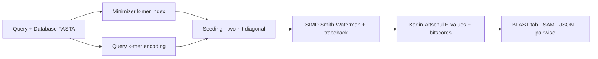

# 🗡️ SABER

### *Smith–Waterman protein homology search — faster, lighter, and more sensitive than DIAMOND, with no database prep.*

<div align="center">


### 🗡️ Full Smith–Waterman • 🚀 Beats DIAMOND • 🪶 No DB prep • 💾 mmap index • 🩺 Self-diagnostics • 🦀 Pure Rust

</div>

---

# 🔬 What is SABER?

**SABER** is a high-performance homology search tool written in **Rust**. It runs *true* **Gotoh affine-gap Smith–Waterman** alignment with **BLAST-compatible output** — and on the UniProt benchmark it comes out **faster, lighter, and more sensitive than DIAMOND**, with no `makeblastdb`-style database build step.

Point it straight at a FASTA, the way SWORD does — then optionally build a memory-mapped index when you want to search the same database again and again:

* 🧬 **blastp** — protein vs protein
* 🧫 **blastn** — nucleotide vs nucleotide
* 🔄 **blastx / tblastn** — translated search (6 frames · 10 genetic codes)

```text
    ____    _    ____  _____ ____
  ╿/ ___|  / \  | __ )| ____|  _ \
◉━╪━━━━━━━━━━━━━━━━━━━━━━━━━━━━━━━━▶
  ╽ ___) / ___ \| |_) | |___|  _ <
   |____/_/   \_\____/|_____|_| \_\

       v1.0.0 · Smith–Waterman protein homology
            fast · sensitive · low-memory
```

---

# ✨ Features

<table>
<tr>
<td width="50%">

## 🧬 Alignment & Scoring

* True Gotoh affine-gap Smith–Waterman
* Linear-space traceback (1-byte direction matrix)
* BLOSUM 45/50/62/80/90 · PAM 30/70/250
* Karlin–Altschul E-values & bit-scores
* CIGAR strings & percent identity
* 4 modes: `blastp` · `blastn` · `blastx` · `tblastn`
* 6-frame translation · 10 genetic codes

</td>
<td width="50%">

## 🚀 Speed & Scale

* AVX2 / AVX-512 SIMD alignment kernel
* Multi-threaded with `rayon`
* Minimizer k-mer index — **no DB-format step**
* Persistent **memory-mapped** index
* `--sensitive` mode for remote homology
* Optional CUDA GPU acceleration
* Single static binary, tiny footprint

</td>
</tr>
</table>

---

# ⚡ Why SABER?

| Feature                                              | SABER |
| ---------------------------------------------------- | :---: |
| 🗡️ Full Smith–Waterman (not seed-and-extend only)   |  ✅   |
| 🚀 Beats DIAMOND on memory, speed **and** sensitivity |  ✅   |
| 🪶 No `makeblastdb` / database-format step required  |  ✅   |
| 🧬 BLAST-compatible `m8` / SAM / JSON output         |  ✅   |
| 💾 Persistent memory-mapped index for huge databases |  ✅   |
| 🎯 Opt-in max-sensitivity remote-homology mode       |  ✅   |
| 🩺 Built-in `--doctor` self-diagnostics              |  ✅   |
| ⚙️ Optional CUDA GPU acceleration                    |  ✅   |
| 🦀 Pure Rust, single static binary                   |  ✅   |

### 📊 Benchmark

100 UniProt queries × 20,000 UniProt subjects · single thread · E ≤ 1e-5:

| Tool                  | Wall time | Peak memory | Hits | Notes                                |
| --------------------- | :-------: | :---------: | :--: | ------------------------------------ |
| **SABER** (default)   | **6.5 s** |  **41 MB**  | **691** | beats DIAMOND on **all three** axes |
| **SABER** (fast)      | **3.8 s** |  **39 MB**  | 683  | ~DIAMOND-default speed, better recall |
| DIAMOND `--sensitive` |  13.9 s   |    52 MB    | 667  | the fair DIAMOND comparison          |
| BLAST `blastp`        |  20.0 s   |    53 MB    | 687  | reference                            |
| SWORD                 |  47.0 s   |   132 MB    | 728  | full SW, most sensitive              |
| SABER `--sensitive`   |  37.8 s   |   468 MB    | 728  | ties SWORD recall (opt-in)           |

> 📈 691 hits is the **no over/under-calling sweet spot** — above BLAST (687), below over-calling heuristics. `--sensitive` matches SWORD's deep recall when you need it. Numbers are single-thread on one benchmark; rerun on your hardware with `benchmarks/` before publishing a claim.

---

# 🧱 Architecture



---

# 🗡️ Tech Stack

| Component            | Technology                                  |
| -------------------- | ------------------------------------------- |
| Language             | Rust ≥ 1.75                                  |
| Alignment kernel     | Gotoh affine-gap Smith–Waterman (own code)  |
| SIMD                 | AVX2 / AVX-512 intrinsics                    |
| Parallelism          | `rayon`                                      |
| GPU (optional)       | CUDA via `cudarc`                            |
| Persistent index     | `memmap2` + `bytemuck` (zero-copy mmap)      |
| CLI                  | `clap`                                       |
| Error handling       | `anyhow` / `thiserror`                       |
| Serialization        | `serde` (JSON output)                        |

---

# 🚀 Installation

## 1️⃣ Install Rust

```bash
curl --proto '=https' --tlsv1.2 -sSf https://sh.rustup.rs | sh
rustup default stable
```

> No admin rights? `rustup` installs entirely into your home folder. On Debian/Ubuntu you can also use `apt-get install rustc cargo`.

---

## 2️⃣ Install SABER

### From crates.io

```bash
cargo install saber-sw
```

### From source

```bash
git clone https://github.com/raw-lab/saber
cd saber
cargo install --path .
```

This builds the optimized binary into `~/.cargo/bin/saber` — make sure that directory is on your `PATH`.

---

## 3️⃣ Optional: GPU build (NVIDIA CUDA)

The default build is CPU-only (small binary, no toolkit dependency). To compile the CUDA Smith–Waterman path you need the CUDA toolkit 11.0+ on the build host:

### From crates.io

```bash
cargo install saber-sw --features gpu-cuda
```

### From source

```bash
git clone https://github.com/raw-lab/saber
cd saber
cargo install --path .
```

`--gpu` cleanly falls back to the multi-threaded CPU pipeline (with a clear message) when the binary wasn't built with CUDA, or when no device is visible.

---

# ⚡ Quick Start

```bash
# 🧬 Protein vs protein (blastp)
saber -q query.faa -d database.faa --mode pp --outfmt m8

# 🧫 Nucleotide vs nucleotide (blastn)
saber -q query.fna -d database.fna --mode nn --outfmt m8

# 🔄 Translated query → protein DB (blastx)
saber -q query.fna -d database.faa --mode nx --outfmt m8

# 🔄 Protein query → translated DB (tblastn)
saber -q query.faa -d database.fna --mode pn --outfmt m8
```

You get the 12-column BLAST tab format — a drop-in replacement for `blastp -outfmt 6`. Pipe it straight into anything that already speaks BLAST tab.

---

# 💾 Persistent Index

By default SABER builds its index in memory on every run (no `makeblastdb` — just point it at a FASTA). For repeated searches, or databases approaching your RAM limit, build a memory-mapped index **once**:

```bash
# Build the index once (self-contained file):
saber --makedb uniprot.sdx -d uniprot.fasta --mode pp

# Search it as many times as you like — memory-mapped, FASTA not needed:
saber -q queries.faa --db uniprot.sdx --mode pp --outfmt m8 -E 1e-5
```

The `--db` path skips the build, pages index data in **on demand** (lower peak memory), and stores subject IDs/lengths inside the index — so the original FASTA isn't needed at query time. Output is byte-identical to a plain in-memory run.

---

# 🎯 Sensitivity Modes

```bash
# Default: fast exact-seed search — beats DIAMOND on the benchmark
saber -q queries.faa -d database.faa --mode pp --outfmt m8

# Maximum sensitivity: BLAST-style neighborhood-word seeding,
# recovers remote homologs (SWORD-level recall). Higher time & memory; opt-in.
saber -q queries.faa -d database.faa --mode pp --outfmt m8 --sensitive
```

---

# 🩺 Health Check

Not sure the install is sound, or debugging a slow/odd run? Ask the doctor:

```bash
saber --doctor
```

It verifies the build/version, **CPU SIMD support (AVX2 — the fast path; a missing-AVX2 warning explains most "why is it slow" cases)**, the Smith–Waterman kernel against a known answer, the indexed search path, the persistent-index save/open round-trip, scoring-matrix integrity, GPU availability, and temp-dir writability. Pass `--query`, `--database`, or `--db` alongside it to validate those files too. It exits non-zero if any check fails — safe to drop into CI.

```text
SABER doctor — self-diagnostics
================================
[ OK ]  build / version                SABER v1.0.0 (64-bit, x86_64 target)
[ OK ]  CPU SIMD (AVX2)                AVX2 present — fast SIMD SW path active
[ OK ]  scoring matrices               6 built-in matrices load and are symmetric
[ OK ]  Smith-Waterman kernel          known-answer test passes
[ OK ]  indexed search vs brute force  finds homologs, rejects the decoy
[ OK ]  persistent index round-trip    save→mmap-open→query is faithful
[ OK ]  temp dir writable              /tmp is writable
[SKIP]  GPU backend                    CPU-only build
Result: HEALTHY — everything checks out.
```

---

# 🧬 Search Modes

| `--mode` | Alias     | Query   | Database | What it does                                       |
| -------- | --------- | ------- | -------- | -------------------------------------------------- |
| `pp`     | `blastp`  | Protein | Protein  | Direct protein–protein S-W with BLOSUM/PAM         |
| `nn`     | `blastn`  | DNA/RNA | DNA/RNA  | Nucleotide S-W with match/mismatch + affine gaps   |
| `nx`     | `blastx`  | DNA/RNA | Protein  | Translate query in 6 frames, then S-W vs protein   |
| `pn`     | `tblastn` | Protein | DNA/RNA  | Translate DB in 6 frames, then S-W vs protein query |

For translated modes the subject ID is suffixed with `|frame{±1,±2,±3}` so you can disambiguate.

### 🧬 Genetic codes

`--genetic-code <NAME-OR-NUMBER>` (default `standard`, NCBI table 1). Supported: `standard` (1), `vertebrate`/`mitochondrial` (2), `yeast` (3), `mold` (4), `invertebrate` (5), `ciliate` (6), `echinoderm` (9), `bacterial` (11), `alt-yeast` (12), `archaeal` (15). Ambiguous codons → `X`; stops emit `*` and translation continues through them.

---

# 📤 Output Formats

`--outfmt` accepts:

| Value  | Description                                                    |
| ------ | ------------------------------------------------------------- |
| `m8`   | 12-column BLAST tab (default; identical to `blastp -outfmt 6`) |
| `m9`   | `m8` with a `#`-prefixed header line                          |
| `m0`   | BLAST pairwise text (60-char alignment blocks)                |
| `sam`  | SAM-format alignment records                                  |
| `json` | Streaming JSON array, one object per HSP                      |
| `csv`  | Comma-separated, RFC-4180-quoted                              |

### The 12 m8/m9 columns

```
query_id  subject_id  pct_identity  align_length  mismatches  gap_opens
q_start   q_end       s_start       s_end         evalue      bitscore
```

```
query1_human_hemoglobin_alpha  db2_hemoglobin_beta_similar  43.45  145  74  8  3  141  4  146  2.77e-36  134.9
```

---

# 📋 CLI Reference

```
saber [OPTIONS] --query <FILE> --database <FILE>

Input:
  -q, --query <FILE>           Query FASTA (omit only with --makedb)
  -d, --database <FILE>        Database FASTA (omit when using --db)
      --makedb <PATH>          Build a persistent index and exit
      --db <PATH>              Search a prebuilt memory-mapped index

Mode & scoring:
      --mode <MODE>            pp | nn | nx | pn            [default: pp]
  -m, --matrix <MATRIX>        BLOSUM45/50/62/80/90, PAM30/70/250  [default: BLOSUM62]
      --match <N>              Nucleotide match score (nn)  [default: 2]
      --mismatch <N>           Nucleotide mismatch (nn)     [default: -3]
  -g, --gap-open <N>           Gap opening penalty          [default: 11]
  -e, --gap-extend <N>         Gap extension penalty        [default: 1]

Sensitivity:
      --sensitive              Neighborhood-word seeding (max recall)
      --minimizer-window <N>   Subject index sparsity (0 = auto)

Filtering:
  -E, --evalue <N>             Drop hits with E > this      [default: 10]
      --percent-identity <N>   Min %-identity 0–100         [default: 0]
  -k, --max-aligns <N>         Max alignments per query     [default: 10]

Output:
  -o, --output <FILE>          Output file (default: stdout)
      --outfmt <FMT>           m8 | m9 | m0 | sam | json | csv   [default: m8]

Translation (nx, pn):
      --genetic-code <CODE>    NCBI table name or number    [default: standard]

Performance:
  -t, --threads <N>            "auto" or a positive integer [default: auto]
      --gpu                    Use GPU if built with --features gpu-cuda

Diagnostics & logging:
      --doctor                 Run self-diagnostics and exit
  -v, --verbose                Debug logging
      --quiet                  Errors only
  -V, --version
  -h, --help                   (opens with the SABER banner ⚔️)
```

Run `saber --help` for the complete, always-current option list.

---

# 🧪 Examples & Testing

The `examples/` folder ships with small FASTA files you can use immediately:

```bash
# Protein search against the bundled demo data
saber -q examples/protein_query.fa -d examples/protein_db.fa --mode pp --outfmt m8
```

```bash
# Run the test suite
cargo test --release
```

Covers the Smith–Waterman kernel, affine-gap traceback, indexed-vs-brute-force agreement, persistent-index round-trips, E-value statistics, and translation correctness.

---

# 📄 License

**Creative Commons Attribution-NonCommercial (CC BY-NC 4.0)**

See the `LICENSE` file for details.

---

# 📖 Citation

If you use **SABER** in published work, please cite:

```bibtex
@software{saber_2026,
  author  = {White III, Richard Allen},
  title   = {SABER: a fast Smith--Waterman protein homology search engine in Rust},
  year    = {2026},
  url     = {https://github.com/raw-lab/saber},
  version = {1.0.0}
}


If you are publishing results obtained using SABER, please cite also cite SWORD: <br />
- Vaser R, Pavlović D, Šikić M. SWORD—a highly efficient protein database search. Bioinformatics. 2016 Sep;32(17):i680-i684. <br />

We stand on the shoulders of giants - Robert Vaser work continues to inspire me, thank you and please cite SWORD.

```

---

# 🤝 Contributing

We welcome:

* 🧬 New scoring schemes and search modes
* ⚡ Kernel and SIMD performance work
* 🌐 GPU / multi-node acceleration
* 📊 Output formats and integrations
* 🧪 Tests and benchmarks

Pull requests and issues are encouraged.

---

# 📞 Support

* 🐛 **Issues:** [SABER Issues](https://github.com/raw-lab/saber/issues)
* 📧 **Contact:** [Dr. Richard Allen White III](mailto:rwhit101@charlotte.edu)

  If you have any questions or feedback, please feel free to get in touch by email. </br>

---

<div align="center">

# 🗡️ SABER

### *Sharp. Sensitive. Fast.*

Built with ❤️ in Rust.

</div>
